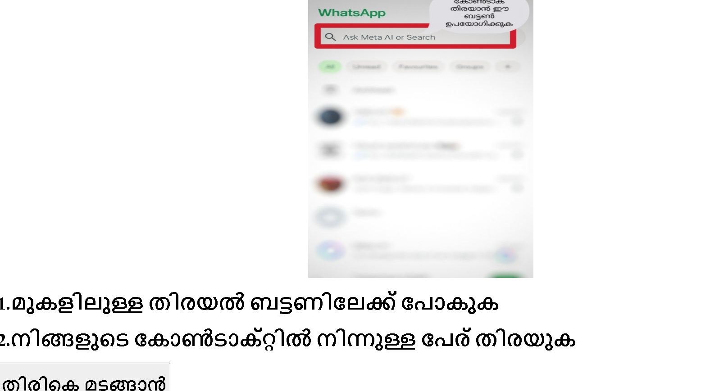

# [A FOR APP] 🎯

## Basic Details
### Team Name: [Bumblebee]

### Team Members
- Member 1: [KRISHNENDU V] - [College of engineering and management punnapra ]
- Member 2: [NANDANA NATH] - [College of engineering and management punnapra]
- Member 3: [PARVATHI JAYAPRAKASH] - [College of engineering and management punnapra ]

### Hosted Project Link
[mention your project hosted project link here]

### Project Description
[A simple web page for teaching old citizen how to use whatsapp(basics applications)]

### The Problem statement
[ the complexity of using applications for senior citizen  ]

### The Solution
[To reduce the complexity of using applications for senior citizen by using native language, more user friendly and giving easiest instructions so they didnt need to write them all step by step and carry with them] 

## Technical Details
### Technologies/Components Used
For Software:
- [html]
- [css]

### Implementation
For Software: the whole process of implementation includes development of the frontend that include basic home page details such as name of the page ,icon of the app that we provide guidance to the user and it is hyperlinked to another page which includes the detailed instructions in malayalam ,with suitable images.
# Installation
[commands]

# Run
[commands]

### Project Documentation
For Software:
  project title : webpage for helping senior citizen
  project overview : the webpage that aimed to providing assistance and guidance to elderly individuals for using whatsapp like applications .the project will provide a user friendly and accessable platform for seniors to seek help and support even when they are alone and helpless. project opjectives: provide the quality of life for elderly individuals by providing them with a reliable and trustworthy support system.

# Screenshots (Add at least 3)

[This screenshot explains the Home page details]

[The given options to help the target users - Elders]

[This is the instructions page which is the actual guidelines to support elder one to use Whatsapp properly]

# Diagrams

*Add caption explaining your workflow*

For Hardware:

# Schematic & Circuit

*Add caption explaining connections*

*Add caption explaining the schematic*

# Build Photos
https://drive.google.com/file/d/1FtpUhJBHTDrhupOyIpDwMyDu16jsfF0O/view?usp=drivesdk

*List out all components shown*

*Explain the build steps*

*Explain the final build*

### Project Demo
# Video
https://drive.google.com/file/d/1FtLsWKSDoq2Q25VllJqQiOBCDPS-DS0d/view?usp=drivesdk

# Additional Demos
[Add any extra demo materials/links]

## Team Contributions
 - [nandana nath]: [ idea ]
- [parvathi jayaprakash]: [program developer]
- [krishnendu v]: [program developer]

---
Made with ❤️ at TinkerHub
